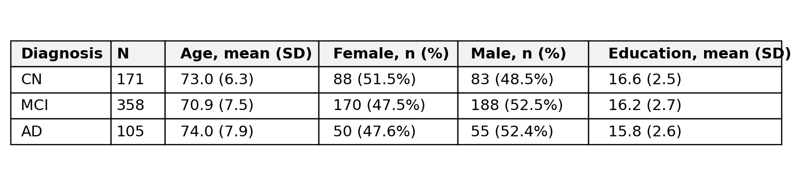

# Structural MRI Brain-Age Gap Regression

*A reproducible structural MRI workflow for testing whether regional brain-age gaps retain more Alzheimer's diagnostic and cognitive information than a single whole-brain gap.*

<p align="center">
  <a href="https://github.com/John-JonSteyn/StructuralMRIBrainAgeGapRegression/stargazers" target="_blank" rel="noopener noreferrer">
    
  </a>
  <a href="https://github.com/John-JonSteyn/StructuralMRIBrainAgeGapRegression" target="_blank" rel="noopener noreferrer">
    
  </a>
  <a href="https://github.com/John-JonSteyn/StructuralMRIBrainAgeGapRegression/commits/main" target="_blank" rel="noopener noreferrer">
    
  </a>
  <a href="https://github.com/John-JonSteyn/StructuralMRIBrainAgeGapRegression/blob/main/LICENSE" target="_blank" rel="noopener noreferrer">
    
  </a>
</p>

---

## Overview

This repository provides the executable analysis for *Regional Brain-Age Gaps Improve Alzheimer's Diagnostic and Cognitive Utility* by Zeeshan Mehmood and John-Jon Steyn.

The study links baseline 3 T T1-weighted MPRAGE scans from the Alzheimer's Disease Neuroimaging Initiative (ADNI) to demographic, diagnostic, and cognitive data. FastSurfer v2.4.2 produces regional morphometric measurements. Brain-age models learn chronological age exclusively from cognitively normal (CN) participants.

Each participant is represented by:

* one scalar whole-brain brain-age gap;
* a vector of 171 regional brain-age gaps; or
* 1,379 raw FastSurfer anatomical predictors.

Brain-age gap is defined as:

```text
predicted brain age - chronological age
```

A positive value indicates older-appearing brain structure. All downstream estimates are subject-level out-of-fold predictions. Scaling, regularisation selection, brain-age estimation, bias correction, diagnostic modelling, and cognition modelling are fitted within the relevant training folds.

The central finding is specific: the regional gap consistently outperforms the scalar gap, but it exceeds hippocampal volume only for the sharper CN-versus-AD contrast. The results do not establish regional brain age as a replacement for established structural markers or as a clinical diagnostic system.

---

## Objectives

The analysis addresses five questions:

1. Can FastSurfer-derived structural MRI features predict chronological age in held-out CN participants?
2. Does a regional brain-age-gap vector retain more diagnostic and cognitive information than a scalar gap?
3. Does brain-age information add value beyond chronological age, sex, and education?
4. Does the regional representation outperform bilateral hippocampal volume or normalised grey-matter volume?
5. Are the conclusions stable across reconstruction-QC thresholds and age-bias corrections?

## Key Findings

The primary result pattern is:

* The regional gap exceeds the scalar gap across both diagnostic contrasts and all four cognitive outcomes.
* The scalar gap does not outperform hippocampal volume on any evaluated outcome.
* The regional gap exceeds hippocampal volume only on CN versus AD; its CN-versus-MCI+AD advantage remains within sampling error.
* Regional and raw representations produce better descriptive calibration than the demographics baseline and scalar gap.
* Bias-correction choice has negligible effect in this cohort.
* The regional-versus-scalar conclusion persists across all four reconstruction-QC thresholds.

### Cohort and Brain-Age Performance

The primary reconstruction-QC cohort contains 634 participants: 171 CN, 358 with mild cognitive impairment (MCI), and 105 with Alzheimer's disease (AD).

| Diagnosis | N | Age, mean (SD) | Female, n (%) | Male, n (%) | Education, mean (SD) |
|---|---:|---:|---:|---:|---:|
| CN | 171 | 73.0 (6.3) | 88 (51.5%) | 83 (48.5%) | 16.6 (2.5) |
| MCI | 358 | 70.9 (7.5) | 170 (47.5%) | 188 (52.5%) | 16.2 (2.7) |
| AD | 105 | 74.0 (7.9) | 50 (47.6%) | 55 (52.4%) | 15.8 (2.6) |

The primary CN-only RidgeCV model achieved MAE 3.582 years and R² 0.459 on held-out CN participants. RidgeCV selected alpha 1,000 in every outer fold. The mean CN scalar gap was approximately +0.09 years, indicating negligible group-level offset in the reference population.

An exploratory fixed `Ridge(alpha=1.0)` model provides a deliberately under-regularised comparator. It achieved MAE 3.839 years and R² 0.364. This exploratory model is not used for the reported diagnostic or cognitive findings.

### Diagnostic Utility and Calibration

| Representation | CN vs MCI+AD AUC | CN vs MCI+AD Brier | CN vs AD AUC |
|---|---:|---:|---:|
| Demographics baseline | 0.535 | 0.2507 | 0.539 |
| Scalar gap | 0.692 | 0.2227 | 0.842 |
| Regional gap | **0.766** | 0.1924 | **0.935** |
| Raw regional features | 0.740 | **0.1865** | 0.921 |
| Hippocampal volume | 0.727 | 0.2119 | 0.881 |
| Normalised grey matter | 0.632 | 0.2377 | 0.769 |

On CN versus MCI+AD, the regional gap exceeded the scalar gap by +0.075 AUC units, with a paired 95% confidence interval of [+0.042, +0.109]. On CN versus AD, the difference was +0.093 [+0.055, +0.131]. Both intervals exclude zero.

The hippocampal comparison is narrower. On CN versus MCI+AD, the regional-minus-hippocampal difference was +0.040 [-0.003, +0.082], so the interval included zero. On CN versus AD, the regional gap exceeded hippocampal volume by +0.053 [+0.015, +0.094]. The evidence therefore supports a regional advantage over hippocampal volume for CN versus AD, not for the combined MCI+AD contrast.

Regional and raw representations also improved probability calibration. Their Brier scores were lower than those of the demographics baseline and scalar gap. Brier-score differences were not subjected to paired significance testing and remain descriptive.

### Cognitive Utility

The demographics-only baseline produced R² -0.012 for MMSE and -0.007 for CDR-SB. The table reports the out-of-fold R² gained by adding each representation. Complete-case sample sizes were 443 for MMSE, 442 for CDR-SB, 196 for ADAS, and 197 for FAQ.

| Representation | MMSE ΔR² | CDR-SB ΔR² | ADAS ΔR² | FAQ ΔR² |
|---|---:|---:|---:|---:|
| Scalar gap | +0.216 | +0.232 | +0.171 | +0.147 |
| Regional gap | **+0.309** | **+0.320** | +0.292 | +0.195 |
| Raw regional features | +0.210 | +0.242 | **+0.318** | **+0.212** |
| Hippocampal volume | +0.249 | +0.272 | +0.194 | +0.155 |
| Normalised grey matter | +0.136 | +0.131 | +0.081 | +0.040 |

Paired tests showed that the regional gap exceeded the scalar gap for MMSE, CDR-SB, ADAS, and FAQ. The FAQ interval excluded zero by a narrow margin. The conclusion rests on the consistent cross-outcome pattern rather than on FAQ alone.

Raw regional features achieved the highest incremental R² for ADAS and FAQ, but they did not consistently outperform the regional gap across outcomes. The regional gap therefore retains a more compact 171-feature representation without claiming universal superiority over the complete raw feature matrix.

### Bias-Correction and QC Sensitivity

Raw, linear, and non-linear age-bias correction produced effectively identical gap distributions. The CN mean gap was 0.099 years in each variant. The MCI+AD mean gap was 3.127 years for the raw variant and 3.125 years for both corrected variants. The CN-trained gap was already close to unbiased, leaving little systematic age trend to remove.

The complete pipeline was independently re-fitted at four `SurfaceHoles` thresholds:

| Reconstruction-QC Rule | Regional Minus Scalar AUC, CN vs MCI+AD | Regional Minus Hippocampal AUC, CN vs AD |
|---|---:|---:|
| No exclusion | +0.067 | +0.049 |
| 97.5th percentile | +0.053 | +0.056 |
| 95th percentile | +0.078 | +0.045 |
| Median + 3 scaled MADs | +0.075 | +0.053 |

The paired regional-minus-scalar interval excluded zero at every threshold. The regional-minus-hippocampal interval for CN versus AD also excluded zero at every threshold. On CN versus MCI+AD, every regional-minus-hippocampal interval included zero. The principal regional-versus-scalar conclusion is therefore QC-robust, while the hippocampal advantage remains specific to CN versus AD.

### Interpretation

The scalar brain-age gap did not outperform hippocampal volume on any evaluated outcome. MCI participants were younger on average than CN participants, AD participants were only slightly older, and the demographics baseline produced near-chance primary diagnostic discrimination. The observed gap effects are therefore not explained by chronological age alone.

Scalar compression discards anatomically heterogeneous disease signal. Regional brain-age gaps preserve spatial structure while retaining the interpretation of deviation from a CN ageing trajectory.

This conclusion does not generalise to every brain-age implementation or dataset. It applies to this cross-sectional ADNI cohort, the specified FastSurfer feature set, the CN-trained models, and the documented out-of-fold evaluation design.

---

## Example Outputs

The visualisation script writes exactly four PNG files to `Outputs/Figures/BrainAge/`. It does not generate PDF figures or place descriptive captions inside the images.

### Table 1: Demographic Characteristics



### Figure 1: Predicted Versus Actual Age


### Figure 2: Brain-Age Gap by Diagnosis


### Figure 3: Diagnostic Calibration


---

## Methodology Summary

### Data Source and Cohort Construction

One baseline or initial 3 T T1-weighted MPRAGE scan is selected per participant. Each image is linked to the nearest eligible same-subject clinical examination within ±90 days. ADNI early-MCI and late-MCI labels are harmonised into the MCI class.

FastSurfer-derived subcortical, cortical, white-matter, and global measurements are assembled with diagnosis, demographic variables, and cognitive outcomes. The modelling table contains 1,382 FastSurfer-derived fields before the three reconstruction-QC `SurfaceHoles` fields are removed, leaving 1,379 anatomical predictors.

### Reconstruction Quality Control

RID 4377 is excluded because its FastSurfer parcellation contains partial missingness. The primary automated reconstruction-quality gate excludes whole-brain `SurfaceHoles` values above:

```text
median + 3 × 1.4826 × median absolute deviation
```

The threshold is 49.13 in the supplied modelling dataset and excludes 54 of the remaining 688 participants. Exclusion rates were 6.0% for CN, 7.5% for MCI, and 11.8% for AD. This assesses FastSurfer surface reconstruction quality. It is not direct raw-image QC for motion or acquisition artefacts.

### Brain-Age Modelling

Five-fold `GroupKFold` produces held-out CN predictions. Within each outer training fold, `StandardScaler` is fitted on CN training participants only and RidgeCV selects alpha from `0.1`, `1`, `10`, `100`, `1,000`, and `10,000`. MCI and AD predictions are averaged across the five CN-trained models.

The scalar model uses all 1,379 anatomical predictors. The regional representation fits a separate age model to the measurements assigned to each of 171 anatomical regions.

### Downstream Evaluation

Every representation is added to a demographics baseline containing age, sex, and education. Diagnosis uses out-of-fold L2 logistic regression and reports AUC and Brier score. Cognition uses out-of-fold RidgeCV and reports R² gain over demographics.

Five-fold `StratifiedKFold` uses shuffling and random seed 42. Paired percentile-bootstrap intervals use `scipy.stats.bootstrap`, 9,999 subject-level resamples, and `random_state=0`.

The diagnostic targets are CN versus MCI+AD and CN versus AD. Cognitive outcomes are MMSE, CDR-SB, ADAS, and FAQ. Each cognition analysis uses complete cases for that outcome.

## Repository Structure

```text
Data/
├── Raw/                              # Restricted ADNI downloads; ignored by Git
├── Interim/                          # Linked and selected local cohort tables
├── Processed/Analysis/               # Modelling input and generated result CSVs
└── README.md                         # Acquisition, layout, and governance instructions
Outputs/
└── Figures/BrainAge/                 # Exactly four generated PNG files
Source/
├── DataPreparation/                  # Clinical and image linkage workflow
├── FeatureExtraction/                # FastSurfer execution and feature assembly
├── Analysis/                         # Modelling-dataset construction
├── Modelling/                        # Brain-age models, evaluation, and QC sensitivity
├── Visualisation/                    # Table and figure generation
└── Utilities/                        # Archive unpacking
requirements.txt
```

## Reproducibility Notes

### Deterministic Result Generation

The workflow fixes every stochastic component used for downstream evaluation. Five-fold stratified models use random seed 42, and paired percentile-bootstrap intervals use 9,999 subject-level resamples with `random_state=0`.

All modelling CSV writers use 17-significant-digit float serialisation. This prevents avoidable precision loss when generated results are saved and reloaded.
### Data Governance

ADNI data are restricted and are not distributed through this repository. Access requires approval through the [LONI Image and Data Archive](https://ida.loni.usc.edu/) and compliance with ADNI data-use agreements.

Raw, interim, processed, and participant-level result data remain excluded from version control. The committed PNGs contain aggregate or de-identified analytical results.

## Reproducing the Pipeline

The scripts require Python 3.10 or later. Install dependencies from the repository root:

```powershell
python -m pip install -r requirements.txt
```

### 1. Prepare the Restricted ADNI Data

Follow [`Data/README.md`](Data/README.md), then run:

```powershell
python Source\Utilities\UnpackRawData.py
python Source\DataPreparation\PrepareInterimData.py
```

### 2. Extract FastSurfer Features and Build the Modelling Dataset

Follow [`Source/FeatureExtraction/README.md`](Source/FeatureExtraction/README.md), then run:

```powershell
python Source\FeatureExtraction\BuildFastSurferRegionalFeatureTable.py
python Source\Analysis\BuildFastSurferModellingDataset.py
```

The required modelling input is:

```text
Data/Processed/Analysis/FastSurferModellingDataset.csv
```

### 3. Run the Primary Brain-Age Analysis

```powershell
python Source\Modelling\RunBrainAgeModelling.py
```

This writes exploratory fixed-alpha and bias-correction results, primary subject-level estimates, the regional-gap matrix, diagnostic and cognition results, out-of-fold predictions, calibration inputs, and paired comparisons to `Data/Processed/Analysis/BrainAgeResults/`.

### 4. Run QC-Threshold Sensitivity

```powershell
python Source\Modelling\RunQcSensitivityAnalysis.py
```

This independently reloads the data and re-fits the complete model at all four QC thresholds.

### 5. Generate the Four PNG Outputs

```powershell
python Source\Visualisation\GenerateBrainAgeFigures.py
```

## Research Context

This repository tests a representation question rather than a direct disease-classification claim. The comparison asks how much information is lost when heterogeneous regional ageing patterns are reduced to one whole-brain value.

The findings support regional brain-age modelling as a compact, interpretable alternative to a scalar gap. They do not show that the regional gap universally exceeds raw morphometric features, established structural biomarkers, or disease-specific models.

## Future Work

* Validate the regional-gap findings externally in cohorts such as OASIS and UK Biobank.
* Model longitudinal regional-gap trajectories as markers of disease progression.
* Investigate disease-aware fine-tuning that preserves regional interpretability.
* Incorporate direct raw-image QC where original scans are available.

## Limitations

* The analysis is cross-sectional and uses one baseline or screening scan per participant.
* `SurfaceHoles` is a reconstruction-quality proxy, not direct raw-image QC; retained motion or acquisition artefacts remain possible.
* AD participants had a higher reconstruction-QC exclusion rate than CN or MCI participants.
* ADNI is an AD-enriched research cohort and is not fully population-representative. The brain-age reference group is restricted to CN participants from this cohort, so external validation is required before generalisation or clinical use.
* Representation dimensionality differs: one scalar gap, 171 regional gaps, and 1,379 raw features. Out-of-fold regularisation limits overfitting but does not equalise information content.
* ADAS and FAQ are available for smaller complete-case subsets than MMSE and CDR-SB.
* The two-stage design computes label-free gap features out of fold before downstream cross-validation. A fully nested single-stage pipeline would provide a stronger validation design.
* These outputs support research interpretation and do not constitute a diagnostic system.

## Supporting Documentation

* [Data acquisition, layout, and governance](Data/README.md)
* [FastSurfer feature extraction](Source/FeatureExtraction/README.md)
* [Modelling commands and output contract](Source/Modelling/README.md)
* [Visualisation outputs](Source/Visualisation/README.md)
* [Generated output layout](Outputs/README.md)

## Licence

This project is released under the MIT Licence. See [`LICENSE`](LICENSE).