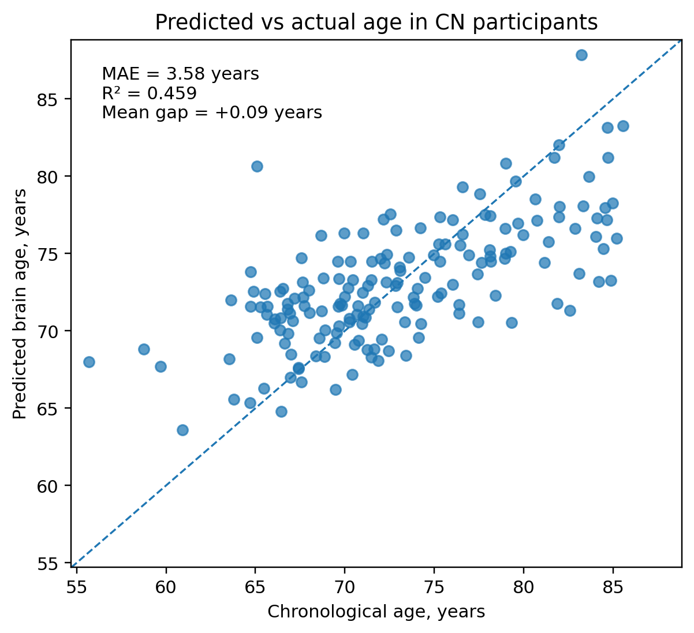
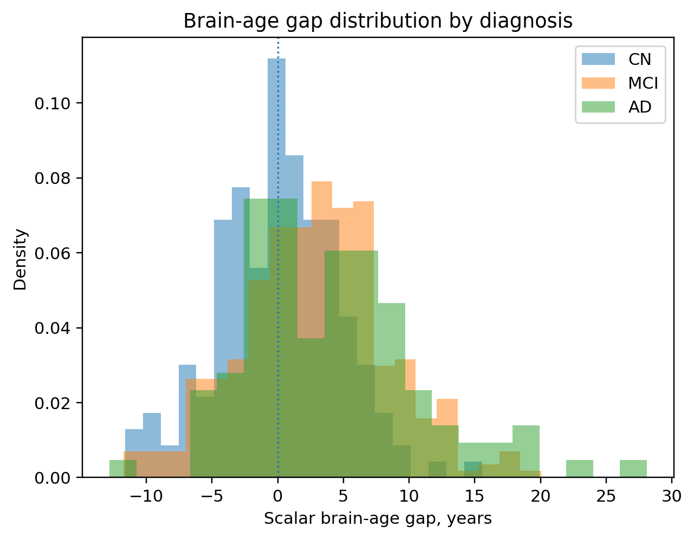
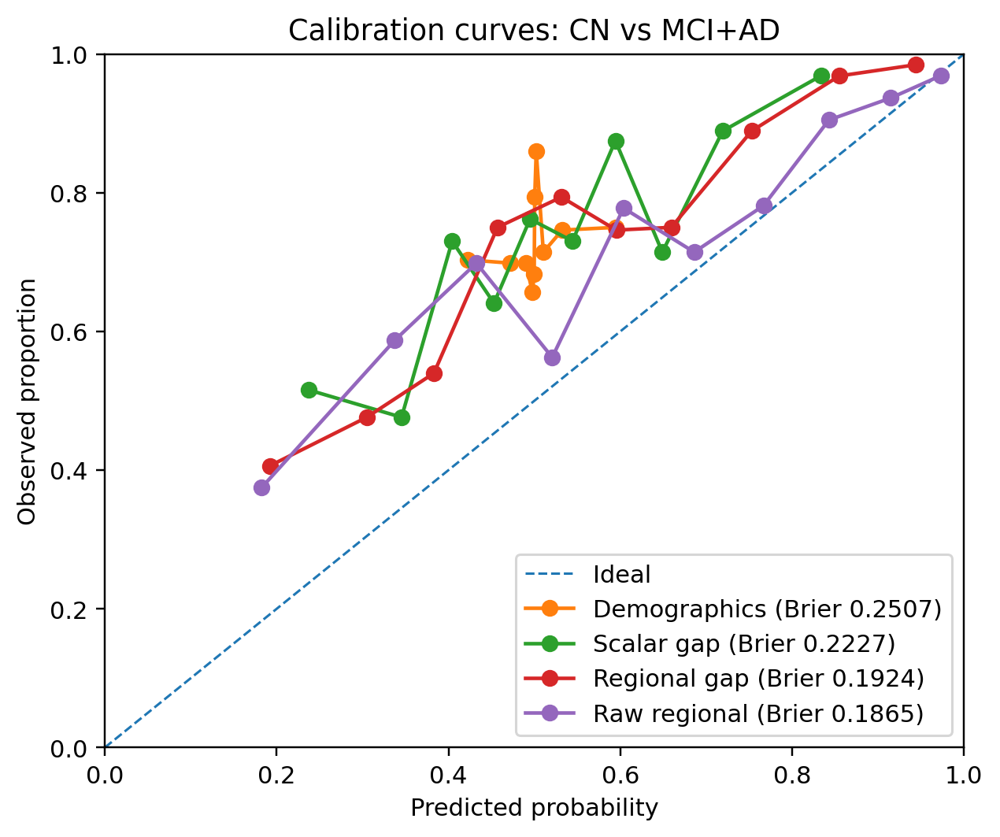

# Alzheimer's Brain-Age Representation Analysis

*A reproducible structural MRI analysis of how scalar, regional, and raw brain-age representations differ in Alzheimer's diagnostic and cognitive utility.*

<p align="center">
  <a href="https://github.com/John-JonSteyn/AlzheimersBrainAgeRepresentationAnalysis/stargazers" target="_blank" rel="noopener noreferrer"></a>
  <a href="https://github.com/John-JonSteyn/AlzheimersBrainAgeRepresentationAnalysis" target="_blank" rel="noopener noreferrer"></a>
  <a href="https://github.com/John-JonSteyn/AlzheimersBrainAgeRepresentationAnalysis/commits/main" target="_blank" rel="noopener noreferrer"></a>
  <a href="https://github.com/John-JonSteyn/AlzheimersBrainAgeRepresentationAnalysis/blob/main/LICENSE" target="_blank" rel="noopener noreferrer"></a>
</p>

---

## Overview

This repository contains the reproducible analysis for *Regional Brain-Age Gaps Improve Alzheimer's Diagnostic and Cognitive Utility* by Zeeshan Mehmood and John-Jon Steyn.

The study uses baseline 3 T T1-weighted MPRAGE scans from the Alzheimer's Disease Neuroimaging Initiative (ADNI). FastSurfer v2.4.2 supplies regional morphometric measurements, and cognitively normal (CN) participants define the reference trajectory for chronological brain ageing.

Three representations are evaluated within the same subject-level out-of-fold framework:

* a scalar whole-brain brain-age gap;
* a vector of 171 regional brain-age gaps; and
* 1,379 raw FastSurfer anatomical predictors.

Brain-age gap is defined as:

```text
predicted brain age - chronological age
```

Positive values indicate older-appearing brain structure relative to chronological age. The analysis asks how much diagnostic and cognitive information is retained as structural MRI is compressed from raw regional measurements to regional age deviations and then to one whole-brain value.

The principal finding is that regional brain-age gaps consistently retain more Alzheimer's-related information than a scalar gap. Their advantage over bilateral hippocampal volume is narrower and specific to the sharper CN-versus-AD diagnostic contrast.

## Research Questions

The analysis addresses five questions:

1. How accurately can FastSurfer-derived structural MRI features predict chronological age in held-out CN participants?
2. Does a 171-region brain-age-gap vector retain more diagnostic and cognitive information than a scalar gap?
3. How much value does each representation add beyond age, sex, and education?
4. How do brain-age representations compare with hippocampal volume and normalised grey-matter volume?
5. How stable are the conclusions across age-bias corrections and reconstruction-quality thresholds?

---

## Findings

### Summary

* The regional gap exceeds the scalar gap across both diagnostic contrasts and all four cognitive outcomes.
* Regional-gap AUC reaches 0.766 for CN versus MCI+AD and 0.935 for CN versus AD.
* The regional gap exceeds hippocampal volume on CN versus AD, with a paired AUC difference of +0.053 and 95% CI [+0.015, +0.094].
* Raw regional features achieve the lowest Brier score and the strongest incremental R² for ADAS and FAQ.
* Raw, linear, and non-linear age-bias corrections produce effectively identical gap distributions.
* The regional-versus-scalar result persists across all four reconstruction-quality thresholds.

### Analytic Cohort

The primary reconstruction-quality cohort contains 634 participants: 171 CN, 358 with mild cognitive impairment (MCI), and 105 with Alzheimer's disease (AD).

| Diagnosis | N | Age, mean (SD) | Female, n (%) | Male, n (%) | Education, mean (SD) |
|---|---:|---:|---:|---:|---:|
| CN | 171 | 73.0 (6.3) | 88 (51.5%) | 83 (48.5%) | 16.6 (2.5) |
| MCI | 358 | 70.9 (7.5) | 170 (47.5%) | 188 (52.5%) | 16.2 (2.7) |
| AD | 105 | 74.0 (7.9) | 50 (47.6%) | 55 (52.4%) | 15.8 (2.6) |

MCI participants are younger on average than CN participants, while AD participants are only slightly older. This age pattern supports interpretation of the observed brain-age differences as deviations from a CN structural ageing trajectory rather than direct reflections of chronological-age imbalance.

### CN Brain-Age Performance

The primary CN-only RidgeCV model achieves an out-of-fold mean absolute error of 3.582 years and R² of 0.459. RidgeCV selects alpha 1,000 in every outer fold. The mean CN scalar gap is approximately +0.09 years, indicating that the reference group is centred close to zero.



Figure 1 compares out-of-fold predicted brain age with chronological age for 171 CN participants. The diagonal represents perfect prediction. The concentration of observations around this line, together with MAE 3.58 years and R² 0.459, establishes the predictive performance of the CN reference model used to derive downstream brain-age gaps.

### Brain-Age Gap Across Diagnosis



Figure 2 shows the distribution of scalar brain-age gaps across CN, MCI, and AD participants. The distribution moves rightward from CN, centred near zero, through MCI to AD. This pattern is consistent with progressively older-appearing brain structure across the diagnostic spectrum, while the overlap between groups motivates evaluation of richer regional representations.

### Diagnostic Utility and Calibration

| Representation | CN vs MCI+AD AUC | CN vs MCI+AD Brier | CN vs AD AUC |
|---|---:|---:|---:|
| Demographics baseline | 0.535 | 0.2507 | 0.539 |
| Scalar gap | 0.692 | 0.2227 | 0.842 |
| Regional gap | **0.766** | 0.1924 | **0.935** |
| Raw regional features | 0.740 | **0.1865** | 0.921 |
| Hippocampal volume | 0.727 | 0.2119 | 0.881 |
| Normalised grey matter | 0.632 | 0.2377 | 0.769 |

On CN versus MCI+AD, the regional gap exceeds the scalar gap by +0.075 AUC units, with a paired 95% confidence interval of [+0.042, +0.109]. On CN versus AD, the difference is +0.093 [+0.055, +0.131].

The regional-minus-hippocampal difference is +0.040 [-0.003, +0.082] for CN versus MCI+AD and +0.053 [+0.015, +0.094] for CN versus AD. The evidence therefore supports a regional advantage over hippocampal volume for the sharper CN-versus-AD contrast.



Figure 3 compares predicted probabilities with observed positive-class proportions for CN versus MCI+AD. The regional gap and raw regional features lie closest to the ideal diagonal and produce the lowest Brier scores. These calibration results complement the AUC comparison by showing that preservation of regional detail improves probability reliability as well as ranking performance.

### Cognitive Utility

The table reports the out-of-fold R² gained by adding each representation to age, sex, and education. Complete-case sample sizes are 443 for MMSE, 442 for CDR-SB, 196 for ADAS, and 197 for FAQ.

| Representation | MMSE ΔR² | CDR-SB ΔR² | ADAS ΔR² | FAQ ΔR² |
|---|---:|---:|---:|---:|
| Scalar gap | +0.216 | +0.232 | +0.171 | +0.147 |
| Regional gap | **+0.309** | **+0.320** | +0.292 | +0.195 |
| Raw regional features | +0.210 | +0.242 | **+0.318** | **+0.212** |
| Hippocampal volume | +0.249 | +0.272 | +0.194 | +0.155 |
| Normalised grey matter | +0.136 | +0.131 | +0.081 | +0.040 |

The regional gap exceeds the scalar gap for MMSE, CDR-SB, ADAS, and FAQ in paired comparisons. Raw regional features lead on ADAS and FAQ, while the regional gap provides the strongest improvement for MMSE and CDR-SB. The 171-region representation therefore retains a substantial share of the raw feature matrix's information in a more compact age-deviation form.

### Bias-Correction and Reconstruction-QC Sensitivity

Raw, linear, and non-linear correction produce a CN mean gap of approximately 0.099 years. The MCI+AD mean gap is 3.127 years for the raw variant and approximately 3.125 years for both corrected variants. The close agreement reflects the near-zero age bias of the initial CN model.

The complete pipeline was independently re-fitted at four `SurfaceHoles` thresholds:

| Reconstruction-QC rule | Regional minus scalar AUC, CN vs MCI+AD | Regional minus hippocampal AUC, CN vs AD |
|---|---:|---:|
| No exclusion | +0.067 | +0.049 |
| 97.5th percentile | +0.053 | +0.056 |
| 95th percentile | +0.078 | +0.045 |
| Median + 3 scaled MADs | +0.075 | +0.053 |

The regional-minus-scalar interval excludes zero at every threshold. The regional-minus-hippocampal interval for CN versus AD also excludes zero throughout the sensitivity analysis. The same inferential pattern is therefore retained across progressively stricter reconstruction-quality criteria.

### Interpretation

The comparison identifies representation choice as a central determinant of brain-age utility. A scalar gap provides a concise summary of overall age deviation, while regional gaps preserve the anatomical distribution of that deviation. In this cohort, that preserved spatial structure carries diagnostic and cognitive information lost during scalar compression.

The regional gap is best interpreted as a compact, anatomically structured representation rather than a universal replacement for raw morphometry or established structural markers. Its strongest comparative evidence is the consistent advantage over the scalar gap and the specific advantage over hippocampal volume for CN versus AD.

---

## Methodology

### Data and Cohort Construction

One baseline or initial 3 T T1-weighted MPRAGE scan is selected per participant. Each image is linked to the nearest eligible same-subject clinical examination within ±90 days. ADNI early-MCI and late-MCI labels are harmonised into the MCI class.

FastSurfer v2.4.2 produces subcortical, cortical, white-matter, and global measurements. The modelling table contains 1,382 FastSurfer-derived fields before the three reconstruction-quality `SurfaceHoles` fields are removed, leaving 1,379 anatomical predictors.

### Reconstruction Quality

RID 4377 is excluded following a partial FastSurfer processing failure. The primary automated quality gate excludes whole-brain `SurfaceHoles` values above:

```text
median + 3 × 1.4826 × median absolute deviation
```

The resulting threshold is 49.13 defects and excludes 54 of the remaining 688 participants. Exclusion rates are 6.0% for CN, 7.5% for MCI, and 11.8% for AD. `SurfaceHoles` provides a consistent automated measure of FastSurfer surface reconstruction quality.

### Brain-Age Representations

Five-fold `GroupKFold` produces held-out CN predictions. Within each outer training fold, `StandardScaler` is fitted on CN training participants and RidgeCV selects alpha from `0.1`, `1`, `10`, `100`, `1,000`, and `10,000`. MCI and AD predictions are averaged across the five CN-trained models.

The scalar model uses all 1,379 anatomical predictors. The regional representation fits an independent age model to the measurements assigned to each of 171 anatomical regions. The raw representation supplies the 1,379 structural predictors directly to the downstream evaluation.

### Diagnostic and Cognitive Evaluation

Every representation is added to a demographics baseline containing age, sex, and education. Diagnosis uses out-of-fold L2 logistic regression and reports AUC and Brier score. Cognition uses out-of-fold RidgeCV and reports R² gain over demographics.

Five-fold `StratifiedKFold` uses shuffling and random seed 42. Paired percentile-bootstrap intervals use 9,999 subject-level resamples with `random_state=0`. Diagnostic targets are CN versus MCI+AD and CN versus AD; cognitive outcomes are MMSE, CDR-SB, ADAS, and FAQ.

---

## Repository Structure

```text
Data/
├── Raw/                              # Restricted ADNI downloads
├── Interim/                          # Linked clinical and imaging tables
├── Processed/Analysis/               # Modelling input and generated result tables
└── README.md                         # Data layout, acquisition, and governance
Outputs/
└── Figures/BrainAge/                 # Generated research figures
Source/
├── DataPreparation/                  # Clinical and image linkage
├── FeatureExtraction/                # FastSurfer execution and feature assembly
├── Analysis/                         # Modelling-dataset construction
├── Modelling/                        # Brain-age models and sensitivity analyses
├── Visualisation/                    # Result figure generation
└── Utilities/                        # Archive preparation
requirements.txt
```

## Reproducing the Analysis

Python 3.10 or later is required. Install the analysis dependencies from the repository root:

```powershell
python -m pip install -r requirements.txt
```

### 1. Prepare ADNI Data

Follow [Data/README.md](Data/README.md), then run:

```powershell
python Source\Utilities\UnpackRawData.py
python Source\DataPreparation\PrepareInterimData.py
```

### 2. Extract FastSurfer Features

Follow [Source/FeatureExtraction/README.md](Source/FeatureExtraction/README.md), then run:

```powershell
python Source\FeatureExtraction\PrepareFastSurferInputs.py
python Source\FeatureExtraction\RunFastSurfer.py
python Source\FeatureExtraction\BuildFastSurferRegionalFeatureTable.py
python Source\Analysis\BuildFastSurferModellingDataset.py
```

The resulting modelling input is:

```text
Data/Processed/Analysis/FastSurferModellingDataset.csv
```

### 3. Run Brain-Age Modelling

```powershell
python Source\Modelling\RunBrainAgeModelling.py
```

This stage writes subject-level estimates, regional-gap matrices, exploratory bias-correction results, diagnostic and cognitive model results, out-of-fold predictions, calibration inputs, and paired representation comparisons to `Data/Processed/Analysis/BrainAgeResults/`.

### 4. Run Reconstruction-QC Sensitivity

```powershell
python Source\Modelling\RunQcSensitivityAnalysis.py
```

This stage re-fits the complete model under all four reconstruction-quality rules.

### 5. Generate Research Figures

```powershell
python Source\Visualisation\GenerateBrainAgeFigures.py
```

The generated figures are written to `Outputs/Figures/BrainAge/`.

## Reproducibility

Scaling, regularisation selection, brain-age estimation, bias correction, diagnostic modelling, and cognition modelling are fitted within the relevant training folds. All downstream estimates use subject-level out-of-fold predictions.

Random seed 42 controls the stratified downstream folds. Paired bootstrap intervals use 9,999 resamples and `random_state=0`. Result CSVs use 17-significant-digit floating-point serialisation to preserve deterministic round trips.

## Data Governance

ADNI data access is administered through the [LONI Image and Data Archive](https://ida.loni.usc.edu/) under the ADNI data-use agreement. Raw images, clinical tables, processed participant data, and subject-level model results remain within the approved local research environment. The repository contains the source workflow and aggregate research figures.

## Study Scope

* The analysis is cross-sectional and uses one baseline or screening scan per participant.
* `SurfaceHoles` measures reconstruction quality; direct raw-image motion and acquisition assessment remains an extension for future work.
* The evidence is derived from an AD-enriched ADNI research cohort and requires external evaluation before population or clinical generalisation.
* Representation dimensionality varies from one scalar gap to 171 regional gaps and 1,379 raw features.
* ADAS and FAQ analyses use smaller complete-case subsets than MMSE and CDR-SB.
* The current two-stage design creates label-free out-of-fold gap features before downstream evaluation; a fully nested single-stage implementation provides a further validation target.

## Future Work

* Evaluate the regional-gap findings in external cohorts such as OASIS and UK Biobank.
* Model longitudinal regional-gap trajectories across disease progression.
* Investigate disease-aware fine-tuning that retains regional interpretability.
* Integrate direct raw-image quality assessment where original scans are available.

## Supporting Documentation

* [Data acquisition, structure, and governance](Data/README.md)
* [FastSurfer feature extraction](Source/FeatureExtraction/README.md)
* [Modelling commands and result tables](Source/Modelling/README.md)
* [Visualisation workflow](Source/Visualisation/README.md)
* [Generated output structure](Outputs/README.md)

## Licence

This project is released under the MIT Licence. See [LICENSE](LICENSE).
